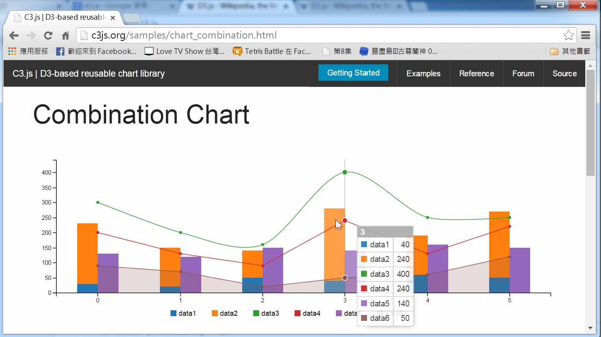

## c3.js -- 基於 d3.js 的簡易繪圖框架

雖然 d3.js 很強大，但是卻並不容易使用，如果我們只是要畫一些簡易的圖形，可以採用延伸自 d3.js 的 c3.js 。

C3.js 的使用非常的簡單，而且互動性很強大。舉例而言，以下是 C3.js 的一個範例，您將滑鼠游標移到圖形上，會顯示對應軸線的資料表格，這讓使用者可以很清楚的看到圖形所對應的數據，這是非常具有互動性的顯示方式。



您可以點選下列網址試試看這個範例，應該可以感覺到 C3.js 好用的地方。

* <http://c3js.org/samples/chart_combination.html> 

而且、要產生上述的圖形，也只需要短短幾行簡單的資料與程式，其程式碼如下所示：

```javascript
var chart = c3.generate({
    data: {
        columns: [
            ['data1', 30, 20, 50, 40, 60, 50],
            ['data2', 200, 130, 90, 240, 130, 220],
            ['data3', 300, 200, 160, 400, 250, 250],
            ['data4', 200, 130, 90, 240, 130, 220],
            ['data5', 130, 120, 150, 140, 160, 150],
            ['data6', 90, 70, 20, 50, 60, 120],
        ],
        type: 'bar',
        types: {
            data3: 'spline',
            data4: 'line',
            data6: 'area',
        },
        groups: [
            ['data1','data2']
        ]
    }
});
```

從以上的範例中，您應該可以看到 C3 這個架構的優點，相較於 D3 而言， C3 容易使用多了。

但是、 C3 並沒有辦法完全發揮 D3 的功能，像是筆者就沒看到 C3 具有任何可以繪製統計 box chart 的功能，因此對於某些較少見的情況而言，我們還是得直接採用 D3 ，另外 C3 的文件說明並不完整，這是筆者所看到的 C3 框架之缺陷。

### 參考文獻
* <http://c3js.org/>
