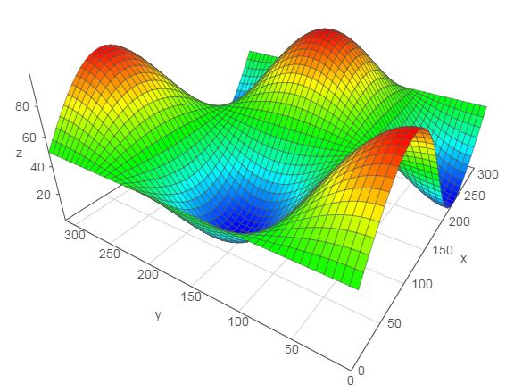
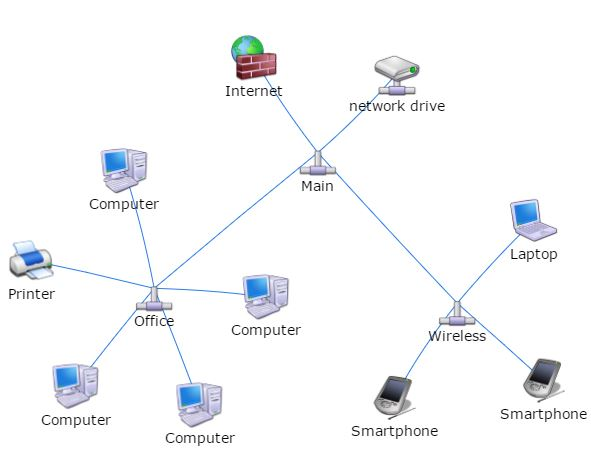

## Vis.js -- 另一個強大的 JavaScript 繪圖函式庫

雖然前述的 d3.js 與 c3.js 可以做到繪圖功能，但是這兩個函式庫強調的是互動性介面，而不是繪圖功能的部份。

於是、我找到了 vis.js 這個專注於繪圖的函式庫，這個函式庫雖然再互動性上表現得沒有 c3 那麼好，但是在繪圖功能上卻非常的完整，該有的圖型幾乎都有，特別是有關「 3D 地形圖」、「網路線圖」和的部份，是 C3 所不具備的功能，因此我們拿 vis.js 來繪製這兩類的圖形。

您可以點選下列連結，看看 vis.js 的眾多範例，相信您會對這個繪圖框架感到印象深刻的。

* <http://visjs.org/#example>

舉例而言、以下網頁是用來繪製 3D 地形圖的完整原始碼，

網址：<http://visjs.org/examples/graph3d/example01_basis.html>



以下是上述範例的完整 HTML 檔案。

```javascript
<!DOCTYPE HTML PUBLIC "-//W3C//DTD HTML 4.01 Transitional//EN" "http://www.w3.org/TR/html4/loose.dtd">
<html>
<head>
  <title>Graph 3D demo</title>

  <style>
    body {font: 10pt arial;}
  </style>

  <script type="text/javascript" src="../../dist/vis.js"></script>

  <script type="text/javascript">
    var data = null;
    var graph = null;

    function custom(x, y) {
      return (Math.sin(x/50) * Math.cos(y/50) * 50 + 50);
    }

    // Called when the Visualization API is loaded.
    function drawVisualization() {
      // Create and populate a data table.
      data = new vis.DataSet();
      // create some nice looking data with sin/cos
      var counter = 0;
      var steps = 50;  // number of datapoints will be steps*steps
      var axisMax = 314;
      var axisStep = axisMax / steps;
      for (var x = 0; x < axisMax; x+=axisStep) {
        for (var y = 0; y < axisMax; y+=axisStep) {
          var value = custom(x,y);
          data.add({id:counter++,x:x,y:y,z:value,style:value});
        }
      }

      // specify options
      var options = {
        width:  '600px',
        height: '600px',
        style: 'surface',
        showPerspective: true,
        showGrid: true,
        showShadow: false,
        keepAspectRatio: true,
        verticalRatio: 0.5
      };

      // Instantiate our graph object.
      var container = document.getElementById('mygraph');
      graph = new vis.Graph3d(container, data, options);
    }
  </script>
</head>

<body onload="drawVisualization();">
<div id="mygraph"></div>

<div id="info"></div>
</body>
</html>
```

而在網路圖方面，您甚至可以指定每個節點應該呈現的圖片，以下是一個繪製電腦網路圖的範例。

* <http://visjs.org/examples/network/03_images.html>



以下是上述範例的完整 HTML 檔案。

```javascript
<!doctype html>
<html>
<head>
  <title>Network | Images</title>

  <style type="text/css">
    body {
      font: 10pt arial;
    }
    #mynetwork {
      width: 600px;
      height: 600px;
      border: 1px solid lightgray;
    }
  </style>

  <script type="text/javascript" src="../../dist/vis.js"></script>
  <link href="../../dist/vis.css" rel="stylesheet" type="text/css" />

  <script type="text/javascript">
    var nodes = null;
    var edges = null;
    var network = null;

    var DIR = 'img/refresh-cl/';
    var LENGTH_MAIN = 150;
    var LENGTH_SUB = 50;

    // Called when the Visualization API is loaded.
    function draw() {
      // Create a data table with nodes.
      nodes = [];

      // Create a data table with links.
      edges = [];

      nodes.push({id: 1, label: 'Main', image: DIR + 'Network-Pipe-icon.png', shape: 'image'});
      nodes.push({id: 2, label: 'Office', image: DIR + 'Network-Pipe-icon.png', shape: 'image'});
      nodes.push({id: 3, label: 'Wireless', image: DIR + 'Network-Pipe-icon.png', shape: 'image'});
      edges.push({from: 1, to: 2, length: LENGTH_MAIN});
      edges.push({from: 1, to: 3, length: LENGTH_MAIN});

      for (var i = 4; i <= 7; i++) {
        nodes.push({id: i, label: 'Computer', image: DIR + 'Hardware-My-Computer-3-icon.png', shape: 'image'});
        edges.push({from: 2, to: i, length: LENGTH_SUB});
      }

      nodes.push({id: 101, label: 'Printer', image: DIR + 'Hardware-Printer-Blue-icon.png', shape: 'image'});
      edges.push({from: 2, to: 101, length: LENGTH_SUB});

      nodes.push({id: 102, label: 'Laptop', image: DIR + 'Hardware-Laptop-1-icon.png', shape: 'image'});
      edges.push({from: 3, to: 102, length: LENGTH_SUB});

      nodes.push({id: 103, label: 'network drive', image: DIR + 'Network-Drive-icon.png', shape: 'image'});
      edges.push({from: 1, to: 103, length: LENGTH_SUB});

      nodes.push({id: 104, label: 'Internet', image: DIR + 'System-Firewall-2-icon.png', shape: 'image'});
      edges.push({from: 1, to: 104, length: LENGTH_SUB});

      for (var i = 200; i <= 201; i++ ) {
        nodes.push({id: i, label: 'Smartphone', image: DIR + 'Hardware-My-PDA-02-icon.png', shape: 'image'});
        edges.push({from: 3, to: i, length: LENGTH_SUB});
      }

      // create a network
      var container = document.getElementById('mynetwork');
      var data = {
        nodes: nodes,
        edges: edges
      };
      var options = {
        stabilize: false   // stabilize positions before displaying
      };
      network = new vis.Network(container, data, options);
    }
  </script>
</head>

<body onload="draw()">

<div id="mynetwork"></div>

</body>
</html>
```

透過這兩個範例，相信您應該可以感覺到 vis.js 的誠意，這真的是一個相當棒的繪圖函式庫啊！

### 參考文獻
* <http://visjs.org/>

