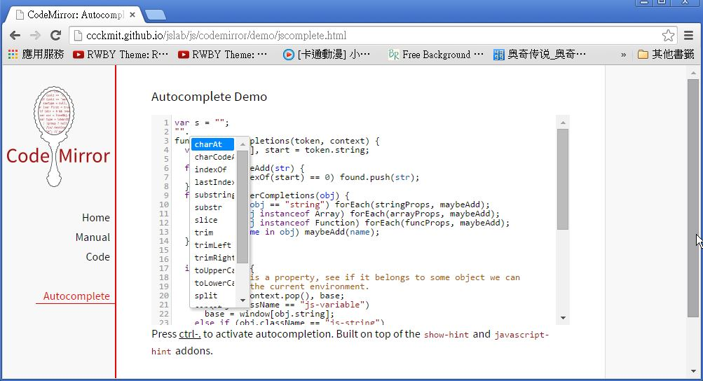

## CodeMirror -- 有 IntelliSense 功能的網頁版開源編輯器

在建構 jsLab 科學計算平台的過程中，由於要讓使用者在 JavaScript 程式編輯上有更好的感受，而不是只能依賴死板板的 textarea 區塊，所以我們找了幾個用 javascript 建構的網頁版程式碼編輯器，像是 Ace、Atom、EditArea 與 CodeMirror 等專案，最後我們認為 CodeMirror 最適合我們使用，因為 CodeMirror 的資源完整，而且具有支援 JavaScript 語言 IntelliSense 功能的插件。

* <https://atom.io/>
* <http://ace.c9.io/>
* <http://www.cdolivet.com/editarea/>
* <http://codemirror.net/>

CodeMirror 支援超過六十種語言的上色與編輯功能，包含 HTML、XML、Javascript、Python、Ruby、C/C++/C#、.... 等等，您可以參考下列網頁。

* <http://codemirror.net/mode/index.html>

另外、 CodeMirror 還支援了下列的特色功能。

* A powerful, composable language mode system
* Autocompletion (XML)
* Code folding
* Configurable keybindings
* Vim, Emacs, and Sublime Text bindings
* Search and replace interface
* Bracket and tag matching
* Support for split views
* Linter integration
* Mixing font sizes and styles
* Various themes
* Able to resize to fit content
* Inline and block widgets
* Programmable gutters
* Making ranges of text styled, read-only, or atomic
* Bi-directional text support
* Many other methods and addons...

其中我們最需要的是 JavaScript 的 Intellisense 功能，該功能的範例網址如下：

* <http://codemirror.net/demo/complete.html>

可惜的是，該範例使用 Ctrl-Space 做為 Intellisense 的功能鍵，但是這個按鍵與繁體中文 windows 的輸入法切換功能相衝，所以沒辦法正常運作，因此我們將該範例的 「Ctrl-Space」 改為 「Ctrl-.」 ，以避免這種衝突的情況，修改版的範例的網址與程式碼如下。

* <http://ccckmit.github.io/jslab/js/codemirror/demo/jscomplete.html>

```javascript
<!doctype html>

<title>CodeMirror: Autocomplete Demo</title>
<meta charset="utf-8"/>
<link rel=stylesheet href="../doc/docs.css">

<link rel="stylesheet" href="../lib/codemirror.css">
<link rel="stylesheet" href="../addon/hint/show-hint.css">
<script src="../lib/codemirror.js"></script>
<script src="../addon/hint/show-hint.js"></script>
<script src="../addon/hint/javascript-hint.js"></script>
<script src="../mode/javascript/javascript.js"></script>

<div id=nav>
  <a href="http://codemirror.net"></a>

  <ul>
    <li><a href="../index.html">Home</a>
    <li><a href="../doc/manual.html">Manual</a>
    <li><a href="https://github.com/marijnh/codemirror">Code</a>
  </ul>
  <ul>
    <li><a class=active href="#">Autocomplete</a>
  </ul>
</div>

<article>
<h2>Autocomplete Demo</h2>
<form><textarea id="code" name="code">
function getCompletions(token, context) {
  var found = [], start = token.string;
  function maybeAdd(str) {
    if (str.indexOf(start) == 0) found.push(str);
  }
  function gatherCompletions(obj) {
    if (typeof obj == "string") forEach(stringProps, maybeAdd);
    else if (obj instanceof Array) forEach(arrayProps, maybeAdd);
    else if (obj instanceof Function) forEach(funcProps, maybeAdd);
    for (var name in obj) maybeAdd(name);
  }

  if (context) {
    // If this is a property, see if it belongs to some object we can
    // find in the current environment.
    var obj = context.pop(), base;
    if (obj.className == "js-variable")
      base = window[obj.string];
    else if (obj.className == "js-string")
      base = "";
    else if (obj.className == "js-atom")
      base = 1;
    while (base != null && context.length)
      base = base[context.pop().string];
    if (base != null) gatherCompletions(base);
  }
  else {
    // If not, just look in the window object and any local scope
    // (reading into JS mode internals to get at the local variables)
    for (var v = token.state.localVars; v; v = v.next) maybeAdd(v.name);
    gatherCompletions(window);
    forEach(keywords, maybeAdd);
  }
  return found;
}
</textarea></form>

<p>Press <strong>ctrl-.</strong> to activate autocompletion. Built
on top of the <a href="../doc/manual.html#addon_show-hint"><code>show-hint</code></a>
and <a href="../doc/manual.html#addon_javascript-hint"><code>javascript-hint</code></a>
addons.</p>

    <script>
      var editor = CodeMirror.fromTextArea(document.getElementById("code"), {
        lineNumbers: true,
        extraKeys: {"Ctrl-.": "autocomplete"},
        mode: {name: "javascript", globalVars: true}
      });
    </script>
  </article>
```

不過、雖然 CodeMirror 支援了 JavaScript 的 Intellisense 功能，但是卻不徹底，對於像是字串之類的語法，他可以顯示提示函數與訊息，但對於變數的部分，卻無法正確提示，以下是一個可以正確提示的範例。



如果需要更進一步的正確提示功能，恐怕還是得修改 CodeMirror 的 `../addon/hint/javascript-hint.js` 模組才行。

雖然 CodeMirror 已經算不錯了，不過我想還有進步空間，但大體來說 CodeMirror 已經是很好的網頁程式編輯器了。

不過、如果您需要的是可以加上「粗體、斜體、字型、超連結、....」等功能，那就不是 CodeMirror 所具備的功能了，這種功能是 RichText Editor 才具備的，您可以參考下列文章中的 RichText 編輯器。

* [5 Free JavaScript Libraries to Add Text Editing to Your Web Application](http://blog.smartbear.com/programming/five-free-javascript-libraries-to-add-text-editing-to-your-web-application/)


### 參考文獻
* <http://codemirror.net/>
* <http://codemirror.net/demo/complete.html>

