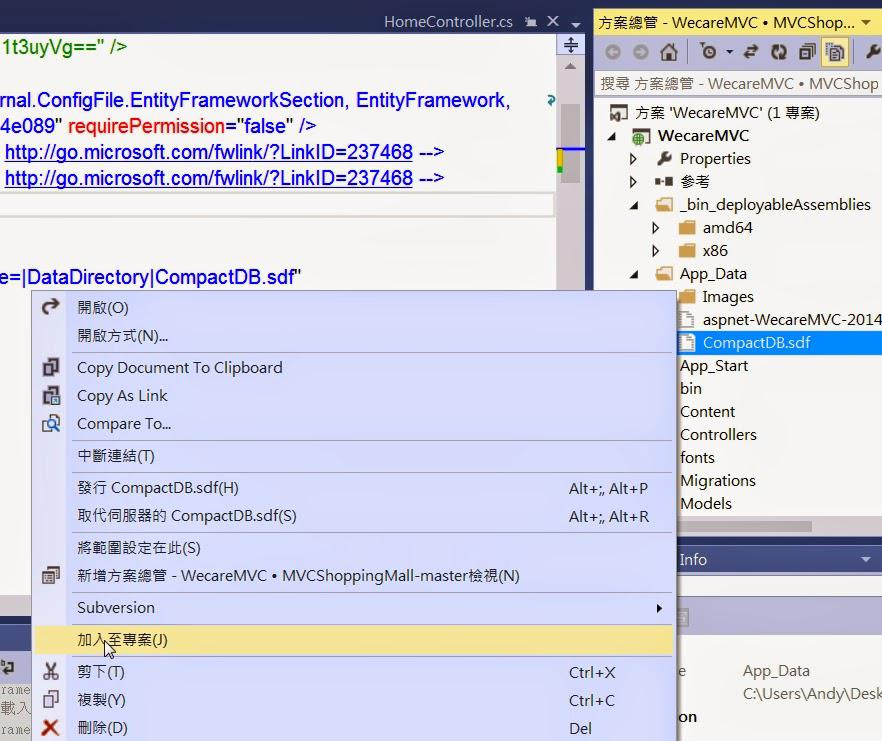

## 利用 SQL Compact Edition 免費建立擁有 DataBase 的 Azure Websites (作者：陳星銘)

 <del> 在只有免費服務才使用 </del>  的這個世代，如果只是一個Demo的小型網站自然不想使用到雲端的SQL DB來做為DataBase (其實只是不想花一個月150左右的DB費用XD)

鑑於想要使用免費Azure Websites，但又想要連接資料庫的人要怎麼做呢？

只能每個月砸150台幣買DB了嗎！？

當然是 **NO！** 

今天就來教大家利用SQL Compact Edition不花一毛錢使用擁有 DataBase 的 Azure Websites 吧！

以下看圖說故事開始：

### 第一步：打開你的VS安裝兩個Nuget套件

為你的專案加入兩個Nuget套件，分別是

1. EntityFrame.SqlServerCompact 
2. Microsoft SQL Server Compact Edition


### 第二步：加入以下連線字串至Web.Config `<connectionStrings> </connectionStrings>` 區段中

```
<add name ="DefaultConnection" connectionString ="Data Source=|DataDirectory|CompactDB.sdf" providerName ="System.Data.SqlServerCe.4.0" />
```

其中
Data Source=|DataDirectory|CompactDB.sdf 可得到相對路徑的 App_Data\CompactDB.sdf


### 第三步：在App_Data中右鍵加入→新增項目→Sql Server 資料庫

注意：這裡我將檔名改為.sdf檔，因為.sdf 很適合小型專案使用，不需要用到.mdf


若你用的和我一樣是MVC的CodeFirst則是改掉你的連線字串後，讓DB自己產生出來，但是這之後有一個很重要的步驟！真的很重要！我卡在這邊很久！操作如下：

產生DB後→點選右上角顯示所有檔案→找到你的CompactDB.sdf→右鍵加入至專案



### 第四步：到你的Azure建立WebSites

左下新增→接著如圖選擇建立網站


### 第五步：

建好網站後，點選你的網站，點選上方設定，拉到下面，填入剛剛的連接字串，選擇"自訂"，按下方儲存


### 第六步：

到儀表板，點選下載發行設定檔，將其儲存在電腦中


### 第七步：

對你的專案按右鍵→發行→匯入→選到剛剛的設定檔→確定→發行


然後就發行成功囉！完成 [網址參考](http://websitewithdbforfree.azurewebsites.net/)

希望有幫助到大家 <del>的錢包</del> ！XD

### 授權說明：

* 本著作係採用姓名標示-非商業性-相同方式分享 3.0 台灣授權。欲查看本授權條款副本，請到 <http://creativecommons.org/licenses/by-nc-sa/3.0/tw/> ，或寫信至Creative Commons, 444 Castro Street, Suite 900, Mountain View, California, 94041, USA.

