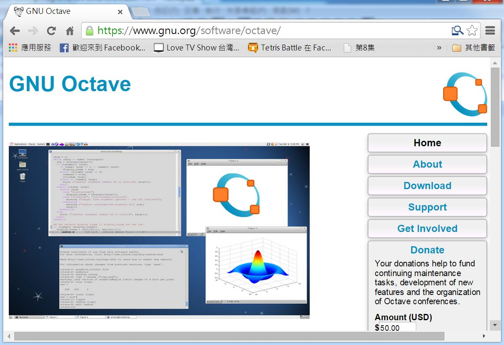
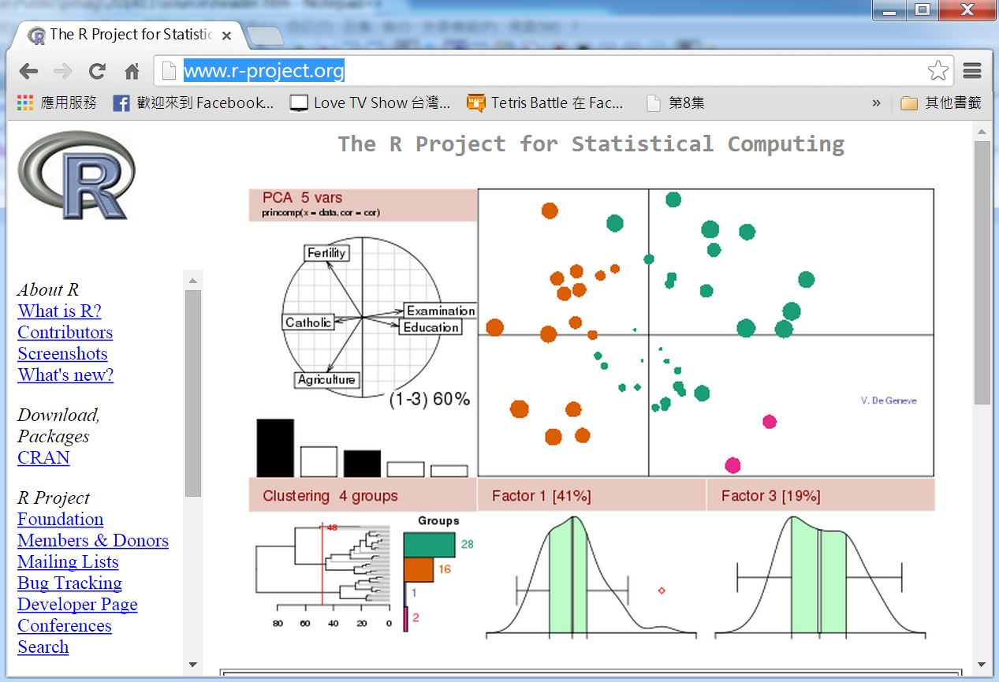
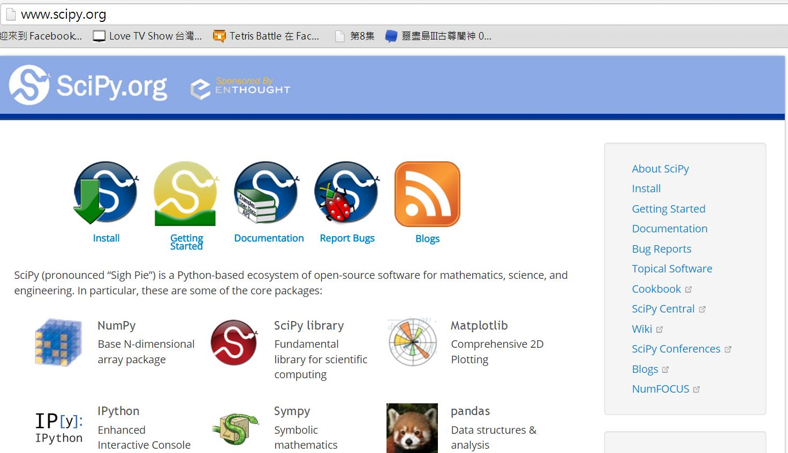

## 科學計算軟體簡介

很多人都曾經使用過「科學計算軟體」，特別是對於進行學術研究的人員而言，這些軟體可以說是不可或缺的。

在工程領域，最常被使用的科學計算軟體是 MatLab，這個軟體從「矩陣運算」出發，建構出了龐大的函式庫，讓使用者可以輕易的透過 Matlab 進行電腦實驗。

另外、在社會科學與統計學領域，很多人會用 SPSS、SAS 等軟體做統計分析，這兩個軟體是從統計出發的科學計算工具。

事實上、開放原始碼領域也有對應的科學計算軟體，像是 R 與 Octave 都是 Open Source 的科學計算軟體。

R 與 SPSS、SAS 的出發點較類似，是從機率統計領域開始建構的，而 Octave 則完全模仿 Matlab 的語法，試圖建構一個與 Matlab 語言相容的科學計算平台，讓 Matlab 的程式資源也可以被 Octave 社群所使用。

在開源的科學計算軟體中， [R 軟體](http://www.r-project.org/) 的使用者似乎是最多的，但是由於 R 採用的程式語言 S3 並非 OpenSource 程式領域的主流，因此也有人試圖用 Python 等語言去建構出科學計算的環境，像是 [SciPy](http://www.scipy.org/) 就整合了 numpy 、sympy、Matplotlib、

雖然已經有了這麼多開放原始碼的科學計算軟體，而且我本身也是 R 的使用者，但是、我仍然感到遺憾！ 

因為我沒辦法找到建構在 JavaScript 語言上的科學計算軟體，所以、我打算自己建造一個，這個計劃就稱為 JsLab (JavaScript Laboratory)。

在下列文章中，我將介紹自己為何要建構 JsLab 專案，如何建構 JsLab 專案，並與大家分享我在建構 JsLab 專案時所學到的一些經驗與心得。

