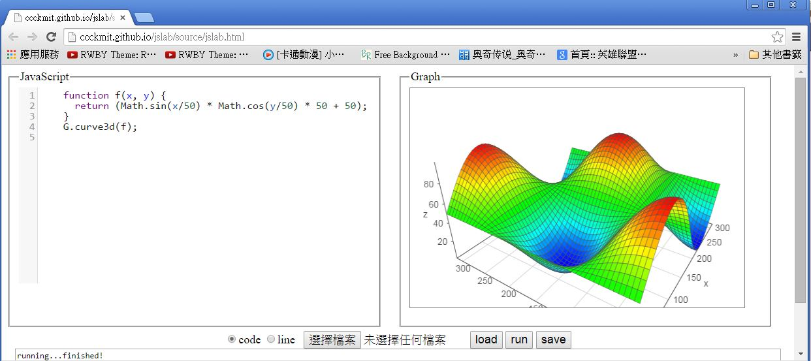

## JsLab -- JavaScript 版的科學計算平台

雖然已經有很多科學計算軟體，像是 MatLab、 Mathematica、SPSS、SAS 等等，而且也有像 R、Octave、SciPy 等開放原始碼的科學計算軟體，但就是沒有以 JavaScript 為主的科學計算軟體。

於是我們決定要用 JavaScript 建構一個科學計算軟體，所以、JsLab 計劃就誕生了，關於 JsLab 的用法，可以參考下列的展示影片。

* [展示影片：jslab -- 一個像 R 的 JavaScript 數學實驗環境](https://www.youtube.com/watch?v=v-lAsFm1zwQ)

下圖是我們已經上傳到 github 上的 JsLab 專案之執行畫面，該程式是一個純粹用 HTML+JavaScript 建構的網頁，網址如下：

* <http://ccckmit.github.io/jslab/source/jslab.html>

您可以連結到該網頁上直接使用該平台，雖然現在還沒有很強大，不過已經可以使用了。



在上述網頁中，我預設在編輯器裏放入了一個展示程式如下， JsLab 會執行該程式後將結果放在訊息視窗，並將繪圖部份顯示在右邊的窗框中。

檔案： curve3D.js

```javascript
function f(x, y) { 
  return (Math.sin(x/50) * Math.cos(y/50) * 50 + 50); 
}
G.curve3d(f);
```

您可以將程式貼到該網頁的程式編輯區，然後按下執行即可得到執行結果。舉例而言、您可以貼上下列程式到編輯區。

檔案： curveT.js

```javascript
G.curve(fx(dt, 3), {name:"dt(3)",  step:0.1});
G.curve("dt(x,10)",{name:"dt(10)", step:0.1});
G.curve(fx(dt, 25),{name:"dt(25)", step:0.1});
```

然後按下執行的 run 按鈕，就可以看到下列的曲線圖。


或者您也可以將下列程式貼到程式區，然後按下執行的 run 按鈕，就可以看到所繪出的散點圖。

檔案： plot1.js

```javascript
Ax = R.rnorm(100, 10, 1);
Ay = R.rnorm(100, 0, 0.5);
Bx = R.rnorm(100, 0, 1);
By = R.rnorm(100, 0, 0.5);
G.plot(Ax, Ay, {name:"A"});
G.plot(Bx, By, {name:"B"});
```


當然、如果您將程式存檔在自己的電腦，那麼您也可以按下「選擇檔案」的按鈕，接著選取想要執行的檔案，就可以將程式上傳並執行，以下是我們透過上傳的方式執行 hist.js 程式的結果。

檔案： hist.js

```javascript
var x = rnorm(1000, 5, 2);
G.hist(x, {name:"x", mode:"normalized"});
G.curve("dnorm(x, 5,2)", {name:"N(5,2)", step:0.2});
```


如果您並不想使用瀏覽器介面，也不需要繪製圖形，那麼您也可以採用 node.js 的命令列執行方式，直接引用 JsLab 背後的函式庫，像是 R.js 進行科學計算的動作，以下是我們在 node.js 中使用 R.js 進行隨機抽樣的一個範例。

檔案： sample.js

```javascript
var U = require("../source/U");
U.use("../source/R", "R");

log("=======二項分布測試===========");
log("pbinom(7, 12, 0.4)="+pbinom(7, 12, 0.4)); // > pbinom(7, 12, 0.4) [1] 0.9426901
log("qbinom(0.9, 12, 0.4)="+qbinom(0.9, 12, 0.4)); // > qbinom(0.9, 12, 0.4)[1] 7
log("qbinom(0.95, 12, 0.4)="+qbinom(0.95, 12, 0.4)); // > qbinom(0.95, 12, 0.4)[1] 8

log("=======常態分布抽樣===========");
log("rnorm="+rnorm);
log("rnorm(5, 2, 1)="+str(rnorm(5,2,1)));
var y = rnorm(25, 0, 2);
log("y="+str(y));

log("=======模擬丟銅板 100 次===========");
log("sample([正, 反], 100)="+sample(["正", "反"], 100));

log("=======模擬擲骰子 100 次===========");
log("sample([1,2,3,4,5,6], 100)="+sample([1,2,3,4,5,6], 100));

```

執行結果

```
D:\Dropbox\Public\jslab\test>node sample.js
use ../source/R name=R
use ../js/jstat.js name=jStat
=======二項分布測試===========
pbinom(7, 12, 0.4)=0.9426900787200003
qbinom(0.9, 12, 0.4)=7
qbinom(0.95, 12, 0.4)=8
=======常態分布抽樣===========
rnorm=function (n, mean, sd) { return R.calls(n, jStat.normal.sample, mean, sd);
 }
rnorm(5, 2, 1)=[2.0748,2.3562,3.014,3.6833,4.1393]
y=[-0.3756,1.2935,-1.9635,0.5446,0.6514,2.7079,-1.2434,-4.8451,1.0937,2.5094,0.1
423,4.6915,1.3294,-1.3275,1.0153,2.5058,-2.5361,1.7784,3.908,-2.2349,0.186,-2.17
17,-1.4398,0.0423,1.2014]
=======模擬丟銅板 100 次===========
sample([正, 反], 100)=正,正,反,反,正,正,反,正,反,反,正,正,反,反,正,正,正,反,反,
正,反,正,反,反,反,反,正,正,正,反,反,反,正,反,正,反,反,正,反,正,正,正,反,正,反,反
,正,反,反,正,正,正,正,正,正,正,正,正,反,反,正,正,反,反,反,反,反,反,正,反,反,正,
反,正,反,反,正,反,正,反,反,反,正,正,反,反,正,正,正,正,反,正,反,反,正,正,反,反,反
,正
=======模擬擲骰子 100 次===========
sample([1,2,3,4,5,6], 100)=3,2,4,6,5,2,4,4,5,5,1,5,1,1,2,1,4,1,1,2,1,4,1,6,1,4,6
,5,1,4,1,6,1,1,2,6,1,5,1,3,3,1,3,4,2,5,6,4,3,5,2,4,3,1,2,1,6,3,2,4,1,2,1,4,2,6,3
,5,4,5,4,4,1,4,2,6,2,4,5,2,3,5,1,3,3,2,3,2,1,3,5,3,2,5,3,6,2,4,1,2
```

另外、目前我們也還持續的在增加 JsLab 函式庫的功能，像是我們正在為 R.js 加上各種統計檢定的功能，以下是採用 node.js 環境執行檢定的一些案例。

由於 jStat 函式庫並沒有支援這些統計檢定的函數，因此筆者只好自行撰寫，為了撰寫這些檢定的程式，我甚至將 R 的原始碼給翻了出來，網址如下：

* <https://github.com/SurajGupta/r-source/tree/master/src/library/stats/R>

以下是我們對這些檢定功能的一些測試範例，大部分的功能都有對應的 R 操作與執行結果，這樣我們就能利用 R 軟體來驗證我們所寫的檢定函數是否正確了。

檔案： rtest.js

```javascript
var U = require("../source/U");
U.use("../source/R", "R");

// x = rnorm(10, 5, 2)
var x = [7.169890 ,2.188864 , 2.963868 ,7.790631 ,2.474261 ,7.694849 ,1.585007 ,4.087697 ,3.051643 ,4.697559];
// y = rnorm(10, 4,2)
var y = [4.9627295,6.0336209,-0.4610221,7.3744023,2.4804347,7.2053190,3.5558563,3.6505476,2.2200754,5.3021459];
// py = x + rnorm(10, 1, 2)
var py= [9.829046 ,2.491387 ,6.037504  ,5.709755 ,5.461208 ,7.345603 ,3.040538 ,4.856838 ,3.195437 ,7.079105];

log("x="+str(x));
log("y="+str(y));

ttest({x:x, mu:6, alpha:0.05, op:"="}).report();

/* 
> t.test(x, mu=6, alpha=0.05)

        One Sample t-test

data:  x
t = -2.1732, df = 9, p-value = 0.05781
alternative hypothesis: true mean is not equal to 6
95 percent confidence interval:
 2.674155 6.066699
sample estimates:
mean of x 
 4.370427 */

ttest({x:x, mu:6, alpha:0.05, op:"<"}).report();

/*
> t.test(x, mu=6, alternative="greater")

        One Sample t-test

data:  x
t = -2.1732, df = 9, p-value = 0.9711
alternative hypothesis: true mean is greater than 6
95 percent confidence interval:
 2.995873      Inf
sample estimates:
mean of x 
 4.370427 
*/

ttest({x:x, mu:6, alpha:0.05, op:">"}).report();

/*
> t.test(x, mu=6, alternative="less")

        One Sample t-test

data:  x
t = -2.1732, df = 9, p-value = 0.02891
alternative hypothesis: true mean is less than 6
95 percent confidence interval:
     -Inf 5.744981
sample estimates:
mean of x 
 4.370427 
*/

ztest({x:x, mu:6, sd:2.5, alpha:0.05, op:"="}).report();

ttest({x:x, y:y, mu:1, alpha:0.05, varequal:true, op:"="}).report();

/*
> t.test(x, y, mu=1, conf.level=0.95, var.equal=T, alternative="two.sided");

        Two Sample t-test

data:  x and y
t = -0.8012, df = 18, p-value = 0.4335
alternative hypothesis: true difference in means is not equal to 1
95 percent confidence interval:
 -2.122363  2.398395
sample estimates:
mean of x mean of y 
 4.370427  4.232411 */

ttest({x:x, y:py, mu:-1, alpha:0.05, paired:true, op:"="}).report();

/*
> t.test(x, py, mu=-1, conf.level=0.95, paired=T)

        Paired t-test

data:  x and py
t = -0.252, df = 9, p-value = 0.8067
alternative hypothesis: true difference in means is not equal to -1
95 percent confidence interval:
 -2.33885689  0.07042649
sample estimates:
mean of the differences 
              -1.134215 */

ttest({x:x, y:y, mu:1, alpha:0.05, op:"="}).report();

/*
> t.test(x, y, mu=1, conf.level=0.95, alternative="two.sided");

        Welch Two Sample t-test

data:  x and y
t = -0.8012, df = 17.985, p-value = 0.4335
alternative hypothesis: true difference in means is not equal to 1
95 percent confidence interval:
 -2.122495  2.398527
sample estimates:
mean of x mean of y 
 4.370427  4.232411 
*/

ftest({x:x, y:y}).report();

/*
> var.test(x,y)

        F test to compare two variances

data:  x and y
F = 0.9445, num df = 9, denom df = 9, p-value = 0.9337
alternative hypothesis: true ratio of variances is not equal to 1
95 percent confidence interval:
 0.2346094 3.8026974
sample estimates:
ratio of variances 
         0.9445362 
*/

var vx = [175, 176, 173, 175, 174, 173, 173, 176, 173, 179];
vartest({x:vx, sd:2, alpha:0.05, op:"="}).report();
// R 軟體沒有此函數，測試請看湯銀才 143 頁
// 信賴區間 (1.793, 12.628)

binomtest({x:7, n:12, p:0.4, op:">"}).report();

/*
> binom.test(x=7, n=12, p=0.4, alternative="less")

        Exact binomial test

data:  7 and 12
number of successes = 7, number of trials = 12, p-value = 0.9427
alternative hypothesis: true probability of success is less than 0.4
95 percent confidence interval:
 0.0000000 0.8189752
sample estimates:
probability of success 
             0.5833333 
*/

binomtest({x:7, n:12, p:0.4, op:"<"}).report();
/*
> binom.test(x=7, n=12, p=0.4, alternative="greater")

        Exact binomial test

data:  7 and 12
number of successes = 7, number of trials = 12, p-value = 0.1582
alternative hypothesis: true probability of success is greater than 0.4
95 percent confidence interval:
 0.3152378 1.0000000
sample estimates:
probability of success 
             0.5833333 
*/


binomtest({x:7, n:12, p:0.4}).report(); // 有誤，p-value 與 R 不同

/*
> binom.test(x=7, n=12, p=0.4)

        Exact binomial test

data:  7 and 12
number of successes = 7, number of trials = 12, p-value = 0.2417 ==> R.js ??? error : pvalue  : 0.1146
alternative hypothesis: true probability of success is not equal to 0.4
95 percent confidence interval:
 0.2766697 0.8483478
sample estimates:
probability of success 
             0.5833333 
*/


proptest({x:91, n:100, p:0.9, correct:false}).report();

/*  1-sample proportions test without continuity correction

data:  91 out of 100, null probability 0.9
X-squared = 0.1111, df = 1, p-value = 0.7389
alternative hypothesis: true p is not equal to 0.9
95 percent confidence interval:
 0.8377379 0.9519275
sample estimates:
   p 
0.91 */

proptest({x:23, n1:102, y:25, n2:135, correct:false}).report();

/*
> success = c(23, 25)
> total = c(102, 135)
> prop.test(success, total)

        2-sample test for equality of proportions with continuity correction

data:  success out of total
X-squared = 0.3615, df = 1, p-value = 0.5477
alternative hypothesis: two.sided
95 percent confidence interval:
 -0.07256476  0.15317478
sample estimates:
   prop 1    prop 2 
0.2254902 0.1851852 
*/

proptest({x:8, n1:100, y:12, n2:200, op:"<", correct:false}).report();

/*
> prop.test(c(8,12), c(100,200), alternative="greater", correct=F)

        2-sample test for equality of proportions without continuity
        correction

data:  c(8, 12) out of c(100, 200)
X-squared = 0.4286, df = 1, p-value = 0.2563
alternative hypothesis: greater
95 percent confidence interval:
 -0.03248088  1.00000000 => R.js ??? [-0.0303,Infinity]
sample estimates:
prop 1 prop 2 
  0.08   0.06 
*/
```

執行結果

```
D:\Dropbox\Public\jslab\test>node rtest
use ../source/R name=R
use ../js/jstat.js name=jStat
x=[7.1699,2.1889,2.9639,7.7906,2.4743,7.6948,1.585,4.0877,3.0516,4.6976]
y=[4.9627,6.0336,-0.461,7.3744,2.4804,7.2053,3.5559,3.6505,2.2201,5.3021]
=========== report ==========
name    : "ttest(X)"
h       : "H0:mu=6"
alpha   : 0.05
op      : "="
pvalue  : 0.0578
ci      : [2.6742,6.0667]
df      : 9
mean    : 4.3704
sd      : 2.3712
=========== report ==========
name    : "ttest(X)"
h       : "H0:mu<6"
alpha   : 0.05
op      : "<"
pvalue  : 0.9711
ci      : [2.9959,Infinity]
df      : 9
mean    : 4.3704
sd      : 2.3712
=========== report ==========
name    : "ttest(X)"
h       : "H0:mu>6"
alpha   : 0.05
op      : ">"
pvalue  : 0.0289
ci      : [-Infinity,5.745]
df      : 9
mean    : 4.3704
sd      : 2.3712
=========== report ==========
name    : "ztest(X)"
h       : "H0:mu=6 when sd=2.5"
alpha   : 0.05
op      : "="
pvalue  : 0.0393
ci      : [2.9008,5.8401]
df      : 10
=========== report ==========
name    : "ttest(X,Y,mu=1,varequal=true) (pooled)"
h       : "H0:mu1=mu2"
alpha   : 0.05
op      : "="
pvalue  : 0.4335
ci      : [-2.1224,2.3984]
df      : 18
mean    : "mean(x)=4.3704 mean(y)=4.2324"
sd      : "sd(x)=2.3712 sd(y)=2.4399"
=========== report ==========
name    : "ttest(x,y,mu=-1,paired=true)"
h       : "H0:mu1=mu2"
alpha   : 0.05
op      : "="
pvalue  : 0.8067
ci      : [-2.3389,0.0704]
df      : 9
mean    : "mean(x-y)=-1.1342"
sd      : "sd(x-y)=1.684"
=========== report ==========
name    : "ttest(x,y,mu=1,varequal=false), Welch t-test"
h       : "H0:mu1=mu2"
alpha   : 0.05
op      : "="
pvalue  : 0.4335
ci      : [-2.1225,2.3985]
df      : 17.9854
mean    : "mean(x)=4.3704 mean(y)=4.2324"
sd      : "sd(x)=2.3712 sd(y)=2.4399"
=========== report ==========
name    : "ftest(X, Y)"
h       : "H0:σ1/σ2=1"
alpha   : 0.05
op      : "="
pvalue  : 0.9337
ci      : [0.2346,3.8027]
df      : [9,9]
ratio   : 0.9445
=========== report ==========
name    : "chisqtest(X)"
h       : "H0:σ1=σ"
alpha   : 0.05
op      : "="
pvalue  : 0.9644
ci      : [1.7926,12.6278]
df      : 9
=========== report ==========
name    : "binomtest({x:7,n:12,p:0.4,op:">"})"
h       : "H0:p>0.4"
alpha   : 0.05
op      : ">"
pvalue  : 0.9427
ci      : [0,0.819]
df      : 1
p       : 0.5833
=========== report ==========
name    : "binomtest({x:7,n:12,p:0.4,op:"<"})"
h       : "H0:p<0.4"
alpha   : 0.05
op      : "<"
pvalue  : 0.1582
ci      : [0.3152,1]
df      : 1
p       : 0.5833
=========== report ==========
name    : "binomtest({x:7,n:12,p:0.4})"
h       : "H0:p=0.4"
alpha   : 0.05
op      : "="
pvalue  : 0.2417
ci      : [0.2767,0.8483]
df      : 1
p       : 0.5833
=========== report ==========
name    : "proptest({x:91,n:100,p:0.9,correct:false}), zprop1"
h       : "H0:p=0.9"
alpha   : 0.05
op      : "="
pvalue  : 0.7389
ci      : [0.8377,0.9519]
df      : 1
p       : 0.91
=========== report ==========
name    : "proptest({x:23,n1:102,y:25,n2:135,correct:false,p:0.5}), zprop2"
h       : "H0:p1-p2=0"
alpha   : 0.05
op      : "="
pvalue  : 0.4446
ci      : [-0.063,0.1436]
df      : 1
p       : [0.2255,0.1852]
=========== report ==========
name    : "proptest({x:8,n1:100,y:12,n2:200,op:"<",correct:false,p:0.5}), zprop2
"
h       : "H0:p1-p2<0"
alpha   : 0.05
op      : "<"
pvalue  : 0.2563
ci      : [-0.0303,Infinity]
df      : 1
p       : [0.08,0.06]
```

